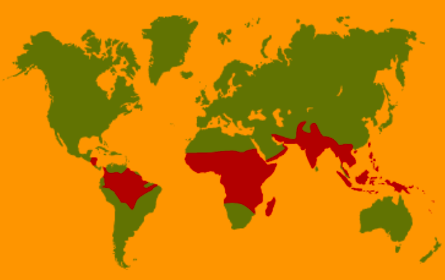
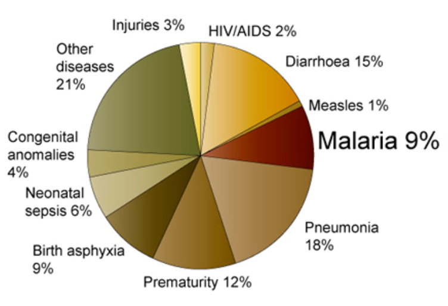

# Introduction 

## Why Malaria?
Malaria is still a serious global health problem killing about 500,000 people every year, more than any other infectious disease except tuberculosis, mainly children under the age of 5. An additional 200 million people get infected with devastating consequences for the economics and the healtcare systems of endemic countries [5] [INSERT LINK HERE].

## What is Malaria?
Malaria is an infectious disease caused by a few plasmodium species (see below) which are single-cell parasites that  get spread around by mosquitos.
Once the plasmodium enters the bloodstream it infects and destroys mainly liver cells and red blood cells
which causes a variety of symptoms, and sometimes even death.

## Who is affected by Malaria?
Amongst the millions of people are especially
* young children under 5 years old
* pregnant women
* patients with other health conditions like HIV/Aids
* travellers with no prior exposure to malaria.

Tropical and subtropical regions are hit the hardest, together the most affected regions form the malaria belt, a belt around the equator that includes most of Latin America, Sub-saharan Africa, South Asia and Southeast Asia (see figure 1 below). Even though the geographical area affected by malaria has shrunk considerably over the past 50 years, imported cases of malaria are now more frequently registered in developed countries [5][INSERT LINK HERE]. Malaria is re-emerging in areas where it was previously under control or eradicated, e.g. in the Central Asian Republics of Tajikistan and Azerbaijan, and in Korea [5][INSERT LINK HERE].

  |  
  |  
|:---:|:---:|
| Figure 1: Malaria [prevalence](https://www.nobelprize.org/educational/medicine/malaria/readmore/global.html "the proportion of a population that at some point in their life have experienced this disease") on a global scale [5][INSERT LINK HERE] |
| Figure 2: 9% of deaths globally among children under the age of 5 are caused by malaria; in Africa 20% of this group dies [6][INSERT LINK HERE]. |

## Are there different types of Plasmodium (P.)?
Yes, there are 100 of plasmodium species but only 5 cause malaria disease in humans [7]:
* P. falciparum
* P. malariae
* P. ovale
* P. vivax
* P. knowlesi (normally infects animals, but occasionally also humans)

## Motivation for the project
To fight this devasating disease, scientists and physicians in the malaria community generate millions of reads from malaria patient blood samples to make diagnoses and push the research in this field forward. These RNA-seq reads are then mapped back to the host and the pathogen; here the read depth, ie number of reds that map to the pathogen or to the host relative to the respective genome, is of special interest but often difficult to predict.

A web tool that predicts the likely percentage of pathogen and host reads is useful to compute the required number of reads and thus saves money or time, in case the necessary read depth was not acquired at the first attempt. 
