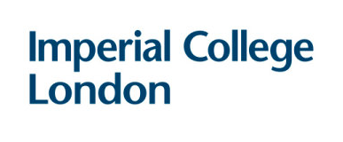

# About `Read map prediction`

This interactive application allows you to predict the percentage of reads that map to the host and to the pathogen based on some information of the patient, ie percentage of parasitemia, number of white blood cells or percentage of monocytes and percentage of lymphocytes.
This allows the user to know the number of reads necessary for their study.
 
## Run this application on R Studio
 
To run this application localy, simple paste the following code on `R` console: 
   ```{r} 
 # First install the following packages:
 library(shiny)
 library(shinyalert)
 library(ggExtra)
 library(ggplot2)
 library(shinythemes)
 library(rmarkdown)
 library(plotly)
 ### run the application:
 shiny::runGitHub("malaria-prediction", "burfel", subdir="shinyapp4")
 ```
 
## Author
Felicia Burtscher | [felicia.burtscher17@imperial.ac.uk](mailto:felicia.burtscher17@imperial.ac.uk)
 
## Credit
This application was developed with [shiny](http://shiny.rstudio.com/) in [R studio](https://www.rstudio.com/). Special thanks go to Dr Aubrey Cunnington and Dr Clive Hoggart for support and advice and the rest of the Pediatrics group at St Mary's Hospital, Imperial College London.


<!---

--->
