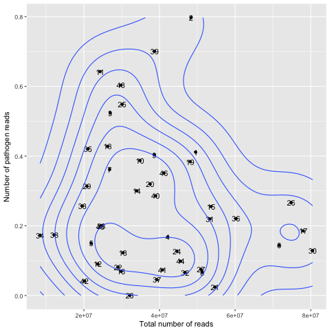
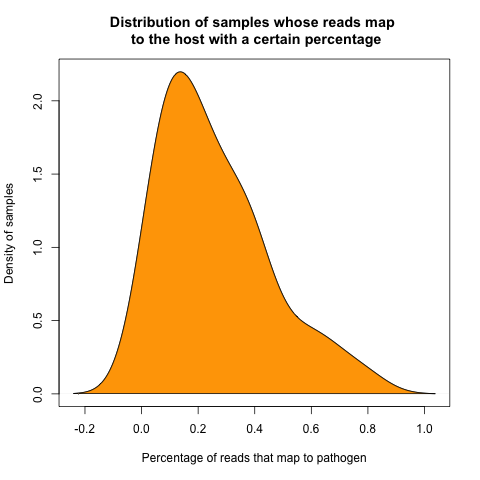

# Abstract

<big>
[Dual RNA-seq](http://journals.plos.org/plospathogens/article?id=10.1371/journal.ppat.1006033 "Why dual RNA-Seq data?") is an increasing popular approach to investigate [host-pathogen interaction](https://www.ncbi.nlm.nih.gov/pmc/articles/PMC96643/ "how microbes sustain themselves within host organisms"). Malaria is an excellent paradigm for its application in humans, because both human [leukocytes](https://www.cancer.gov/publications/dictionaries/cancer-terms/def/leukocyte "ie white blood cells. They are part of the body's immune system and help the body to fight infection and other diseases.") and malaria parasites are present in circulating blood. However, application of this approach has been limited by variability in the [depth of reads](https://emea.illumina.com/science/education/sequencing-coverage.html "average number of reads that align to, ie cover, known reference bases") mapped to parasites, with some studies finding insufficient parasite reads for analysis. It has been found that parasite reads constitute between 1% and 70% of the total reads obtained from patient blood samples (see figure 1 and figure 2 below), and this appears to be dependent on three main factors:

1) the number of parasites in the blood sample, 

2) the number of human white blood cells in the sample, and 

3) the developmental stage of the parasites. 

For physicians and biologists in the malaria community it is of substantial use to know how many of the dual RNA-seq reads will map to the host, and how many will map to the pathogen in order to compute the read depth. This way, they will know how many reads are necessary in the first place for the study of interest. 
The purpose of this project was to develop a __simple prediction tool__ that will enable a user to __estimate the likely proportion of reads__ that will map to parasite and host, given basic information on the sample. This will be of substantial use to the __malaria__ research community as no such tool exists yet to our knowledge.
For the web tool (see chapter _Results_) we implemented a logistic regression model, ie a generalized linear model with a logit transformation, based on the sample data set (see chapter _Data_). We cross-validated the performance of our model on the the samples that were non-complete, ie containing missing values, and therefore not used in the training data set after imputing the missing values [INSERT STATISTICS HERE]. However, further validation of our model should be made after more data has become available. 
<br>
</br>
<p>
    
</p>
**Figure 1:** Scatterplot of the data set: Number of total reads in sample against percentage that map to pathogen. The numbers indicate the sample IDs.
<br>
</br>
<p>
    
</p>
**Figure 2:** Density plot of reads that map to the pathogen: The percentage varies a lot, in the given data set most samples mapped with around 18% of the total reads to the pathogen. Note: The area under the curve itegrates to 1.

<!---


**Figure 1:** Scatterplot of the data set: Number of total reads in sample against percentage that map to pathogen. The numbers indicate the sample IDs.


**Figure 2:** Density plot of reads that map to the pathogen: The percentage varies a lot, in the given data set most samples mapped with around 18% of the total reads to the pathogen. Note: The area under the curve itegrates to 1.
--->

---
**Note:**

The web tool can be found in chapter _Results_. 
For more information on what data set the model was built, see chapter _Data_ as well as chapter _Methods_.

---
</big>

<!---
## Table of Contents
  * [Chapter 1: Introduction](#chapter-1)
  * [Chapter 2: Methods](#chapter-2)
  * [Chapter 3: Results](#chapter-3) 
  * [Chapter 4: Discussion](#chapter-4) 
  * [Chapter 5: Conclusion](#chapter-5) 
  * [Chapter 6: Data](#chapter-6) 
  * [Chapter 7: References](#chapter-7) 
  * [Chapter 8: Glossary](#chapter-8) 
  * [Chapter 9: About](#chapter-9) 
--->

<!---
  ![alt text][total_reads_outcome] |
![alt text][density]            |
|:-----:|:--------------:|
Figure 1: Number of total reads in sample against percentage that map to pathogen | Figure 2: Density plot of reads that map to the pathogen | | Note: The area under the curve itegrates to 1.
-->
<!---

-->


[density]: ../img/pathogen_read_density.png "Density plot visualising the variation of reads that map to the pathogen"
[total_reads_outcome]: ../img/total_reads_outcome.png "Scatter 2d density estimationo: Total number of reads against the percentage of these that map to pathogen"

<!---
<div>
###A title using myStyle.css {.bigbaseline}
</div>
--->

<!---
```{r, cache=FALSE, fig.cap="Figure 1: Number of total reads in sample against percentage that map to pathogen"}
img1_path <- "../img/total_reads_outcome.png"
img1 <- readPNG(img1_path, native = TRUE, info = TRUE)
attr(img1, "info")
```

```{r}
# All defaults
include_graphics(img1_path)
```

---
class: middle

.pull-left[
```{r, cache=FALSE, fig.cap="Figure 1: Number of total reads in sample against percentage that map to pathogen", echo=TRUE}

print("This works")
```
]

.pull-right[
```{r, cache=FALSE fig.cap="Figure 2: Density plot of reads that map to the pathogen"}

```
]

---
--->
