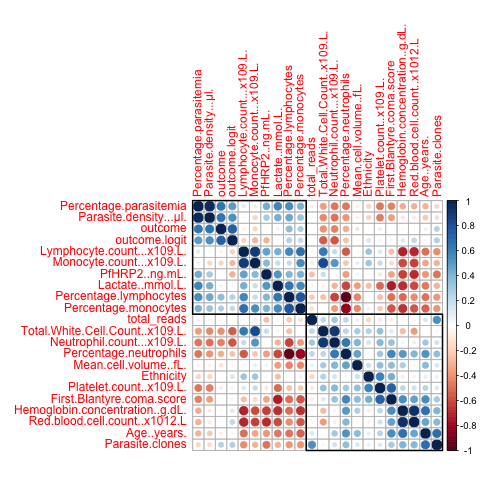

## Variable Selection
<big>

**Having a tiny sample with lots of variables, we needed to choose the most explaining variable(s) for a simple model. Also, we need to choose the variable(s) based on the utility for the user.**

### 3. Model selection
We needed to choose an appropriate model that explains the 
data well but is simple enough to not overfit the data.

### 4. Checking assumptions of linear regression model 
For a linear regression model, we needed to check the model 
assumptions.

### 5. The generalized linear model (GLM) 
In cases where for certain response variables the just tested 
assumptions do not hold, generalized linear models (GLM) are 
excellent at dealing with them. 

### 6. Cross-validation / estimating performance of model(s) 
As we only had one data set available to train and test our 
model, we were restricted to cross-validation on the original 
data set. 

The goal was to keep the model as small as possible but as best performing as possible. Certainly there is a trade-off (see chapter _Discussion_) between these two goals.

For variable selection we looked at the correlation matrix and included domain knowledge, eg which type of data a user is most likely to have. The categorical variables (including gender and ethnicity) were encoded as "dummy" variables.
A lot of the variables were collinear, ie in a near-linear relationship, eg monocyte percentage and monocyte counts or lymphocytes with monocytes and neutrophils and various others (see figure 1).
Using heursitic apprach (see figure 1 and procedure below), we identified parasitemia (in form of percentage or density) and the number of white cells or its constituents (lymphoctes, monocytes and neutrophils) as appriopriate variables to include in our model. In general, we would want to include the ones that do not correlate much with the first independent variable (in our case parasitemia) so that a small model can caputure much variance and results in a better performance, ie we want to avoid between-predictor correlations.

Our procedure to determine the two most suitable variables:
```
1. We calculated the correlation matrix based of the predictors.
2. We determined the two predictors associated with the largest absolute pairwise correlation (let us call them predictors A and B).
3. We determined the average corrleation between A and the other variables. The same we did for predictor B.
4. If A had a larger average correlation, we removed it; otherwise we removed predictor B.
5. We repeated steps 2-4 until we had the desired amount of variables selected (here: 2); we could have defined a threshold as a lower bound for the absolute correlations (eg 0.4 would hold in our case).
```
This way we identified parasitemia percentage and white blood cell count. As alernative and (almost) equally good variables we identified parasitemia density and the ensemble of different white blood cell types (lymphoctes, monocytes and neutrophils).

Here, domain knowledge was important, too. Also, we chose the variable(s) based on the utility for the user. Most often people will just have parasitemia or parasite density data. In some cases they may have white cell count data, too.

<p>
    
</p>
**Figure 1:** Correlation matrix (clustered version) of the variables in the sample used for variable selection. Each pairwise correlation is computed from the data set and coloured according to its magnitude. Note this matrix is symmetric: the top and bottom diagonals show identical information. Dark blue colours indicate strong positive correlations, dark red is used for strong negative correlations; white implies no empirical relationship between the predictors. Here the predictor variables have been grouped using a clustering technique [12] so that collinear predictors are close to one another. Looking along the diagonal, there are blocks of strong positive correlations that indicate "clusters" of collinearity. 
Therefore, it would be meaningful to include two predictors that are not in the same group -- eg parasitemia (percentage or density) and total number of white cell counts meet this condition.
</big>
