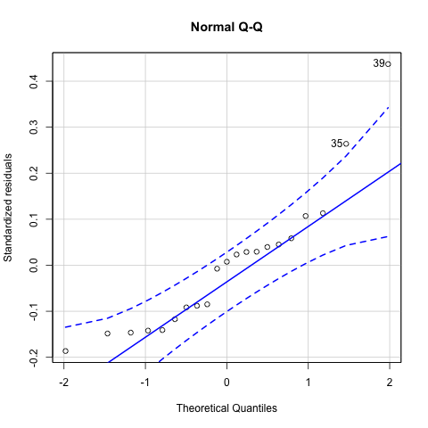
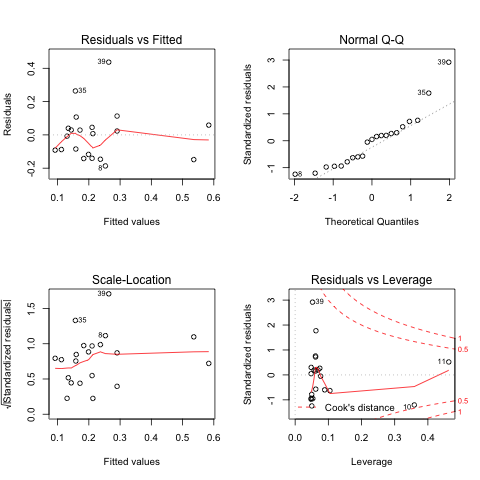
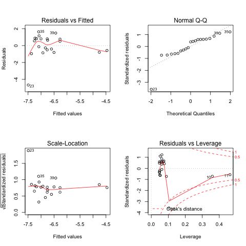
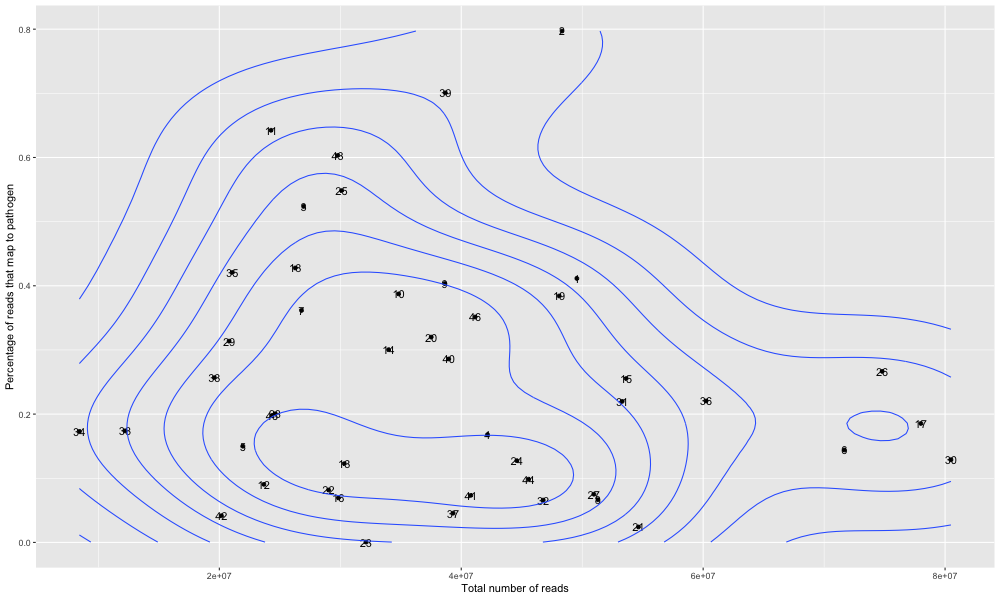

## Checking assumptions of linear regression model

<big>
Linear regression makes several key assumptions that we might want to test:

* There must be a **linear relationship** between the outcome variable and the independent variables. Using **scatterplots** can show whether there is a linear or curvilinear relationship.
The plot of the relationship between percentage of parasetemia and the outcome variable is shown in figure 1 in subchapter _Model selection_.

* Multivariate normality–multiple regression assumes that the **residuals are normally distributed**. The **Q-Q plot** in figure 1.2 (top right) and figure 1 show that the residuals of the linear model with parasitemia percentage roughly follow a normal distribution. 
The two outliers we identified (sample 35 and 39) could be discarded but due to the very few data available, we decided not to but accepted it to represent variance in the biological data set. We can see these two outliers as well as other possible intuitive outliers (samples 7, 10, 11, 19) do influence the regression line (see figure 3).

    

**Figure 1:** Q-Q plot of the residuals of the simple model with percentage of parasite

* No **Multicollinearity** Multiple regression assumes that the independent variables are not highly correlated with each other. We can test this assumption using Variance Inflation Factor (VIF) values; however by applying the algorithm outlined in subchapter _Variable selection_, we already made sure that the independent variables correlate as least as possible or under a certain threshold.

* **Homoscedasticity**, ie the variance of error terms are similar across the values of the independent variables. A plot of **standardised residuals** versus predicted values can show whether points are equally distributed across all values of the independent variables (see figure 1.3 (bottom left)).

By looking at residuals in the linear model, we can get new insights about the model and the data itself. 

    

**Figure 2:** Summary plots of the linear model (percentage of parasitemia) without tranformation:
* **Residuals vs fitted** (top left): The residuals are equally spread around a horizontal line and show no severe non-linear patterns. This is a good indication that there is no non-linear relationship that would not be captured by our linear model.
* **Normal Q-Q** (top right): The residuals follow more or less the straight dash line (except two posible outliers 35, 39 -- these might be a potential problem) indicating that the residuals are normally distributed.
* **Scale-Location** (bottom left): The residuals are not equally (randomly) spread along the horizontal line. Therefore, our model assumption of homoscedasticity (ie equal variance) is not fully fulfilled.
* **Residuals vs Leverage** (bottom right): This plot helps us to identify influential cases if there are any. Even though the data has extreme values or outliers (potentially 35, 39) they do not seem influential to determine a regression line. They are not outside of the Cook’s distance (meaning they have high Cook’s distance scores, within the dashed line), and therefore the results would not be much different if we excluded them as they "follow the trend". Here the patterns within the "Cook's distance tube" is not relevant.

However, if we make the test to exclude some potential outlier samples, we do get slightly different slope coefficients (see figure 4), but 35 and 39 identified here do not seem to make much of a difference compared to the model on our complete samples.

    

**Figure 3:** Summary plots of the linear model (percentage of parsitemia) with logit transformation. 
 
 

    

**Figure 4:** Regression lines when considering different subsets of our data set. 
 
 

---
**The upshot**

Checking the plots in figure 2, comparing it to the model with logit transformation in figure 3 and performing a Kolmogorov-Smirnov test on the residuals to check the goodness-of-fit we can see that for a linear model with parasitemia percentage the model assumptions roughly hold -- with using the original outcome variable we can fit a line that is a good representation of the relationship. A log transformation or including quadratic terms do not seem to be necessary to explain the relaitonship between parsitemia percentage and the response variable. However, for a more complex model (eg including white blood cells) and for the analysed mouse data set the assumptions clearly did not hold. The residuals were not uniformally distributed (the response variable does not have to be Gaussian!).
We might want to transform the outcome variable so that it forms a reasonable linear relationship with the independent variable(s).
Therefore, we looked at various other models including generalized linear models (GLMs) and beta regression. 

---

In the web tool presented in chapter _Results_ we use a generalized linear model with a logit link function, as this has various advantages (see subchapter _The generalized linear model_).
</big>
