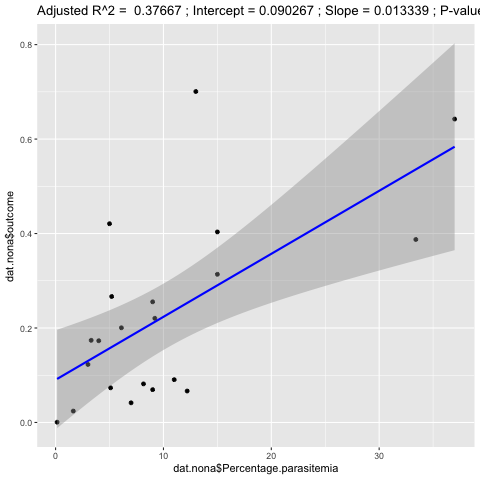
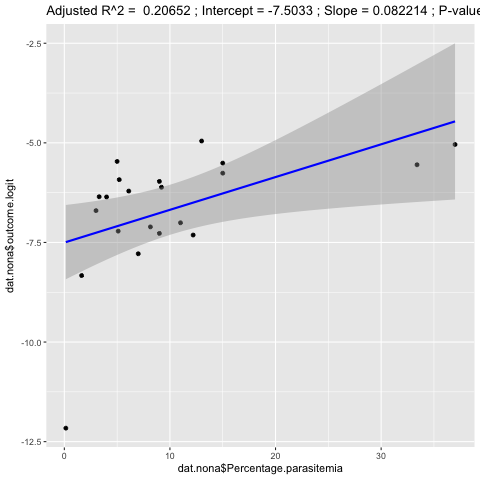

## Checking assumptions of linear regression model

<big>
Linear regression makes several key assumptions that we might want to test:

* There must be a **linear relationship** between the outcome variable and the independent variables. Using **scatterplots** can show whether there is a linear or curvilinear relationship.
The plot of the relationship between percentage of parasetemia and the outcome variable is shown in figure 1 in subchapter _Model selection_.

* Multivariate normality–multiple regression assumes that the **residuals are normally distributed**. The **Q-Q plot** in figure 1.2 (top right) and figure 1 show that the residuals of the linear model with parasitemia percentage roughly follow a normal distribution. 
The two outliers we identified (sample 35 and 39) could be discarded but due to the very few data available, we decided not to but accepted it to represent variance in the biological data set. We can see these two outliers as well as other possible intuitive outliers (samples 7, 10, 11, 19) do influence the regression line (see figure 3).

    

**Figure 1:** Q-Q plot of the residuals of the simple model with percentage of parasite

* No **Multicollinearity** Multiple regression assumes that the independent variables are not highly correlated with each other. We can test this assumption using Variance Inflation Factor (VIF) values; however by applying the algorithm outlined in subchapter _Variable selection_, we made sure that the independent variables correlate as least as possible.

* **Homoscedasticity**, ie the variance of error terms are similar across the values of the independent variables. A plot of **standardised residuals** versus predicted values can show whether points are equally distributed across all values of the independent variables (see figure 1.3 (bottom left)).

By looking at residuals in the linear model, we can get new insights about the model and the data itself. 

    

**Figure 2:** Summary plots of the linear model (percentage of parasitemia) without tranformation:
* **Residuals vs fitted** (top left): The residuals are equally spread around a horizontal line and show no severe non-linear patterns. This is a good indication that there is no non-linear relationship that would not be captured by our linear model.
* **Normal Q-Q** (top right): The residuals follow more or less the straight dash line (except two posible outliers 35, 39 -- these might be a potential problem) indicating that the residuals are normally distributed.
* **Scale-Location** (bottom left): The residuals are not equally (randomly) spread along the horizontal line. Therefore, our model assumption of homoscedasticity (ie equal variance) is not fully fulfilled.
* **Residuals vs Leverage** (bottom right): This plot helps us to identify influential cases if there are any. Even though the data has extreme values or outliers (potentially 35, 39) they do not seem influential to determine a regression line. They are not outside of the Cook’s distance (meaning they have high Cook’s distance scores, within the dashed line), and therefore the results would not be much different if we excluded them as they "follow the trend". Here the patterns within the "Cook's distance tube" is not relevant.

However, if we make the test to exclude some potential outlier samples, we do get slightly different slope coefficients (see figure 4), but 35 and 39 identified here do not seem to make much of a difference compared to the model on our complete samples.

    

**Figure 3:** Summary plots of the linear model (percentage of parsitemia) with logit transformation. 
 
 

    

**Figure 4:** Regression lines when considering different subsets of our data set. 
 
 

<!---

    

**Figure 5:** Regression line of the simple linear regression model with 95% interval shaded in grey using percentage of parasitemia and the sample data set. 
 
 

    

**Figure 5:** Regression line of the simple linear regression model with 95% interval shaded in grey using percentage of parasitemia and a logit transformation on the response variable and the sample data set.  
--->

---
**The upshot**

Checking the plots in figure 2, comparing it to the model with logit transformation in figure 3 and performing a Kolmogorov-Smirnov test on the residuals to check the goodness-of-fit we can see that for a linear model with parasitemia percentage the model assumptions roughly hold -- with using the original outcome variable we can fit a line that is a good representation of the relationship. A log transformation or including quadratic terms do not seem to be necessary to explain the relaitonship between parsitemia percentage and the response variable. However, for a more complex model (eg including white blood cells) and for the analysed mouse data set the assumptions clearly did not hold. The residuals were not uniformally distributed (the response variable does not have to be Gaussian!).
We might want to transform the outcome variable so that it forms a reasonable linear relationship with the independent variable(s).
Therefore, we looked at various other models including generalized linear models (GLMs) and beta regression. 

---

In the web tool presented in chapter _Results_ we use a generalized linear model with a logit link function, as this has various advantages (see subchapter _The generalized linear model_).
</big>

<!---
## Plotting residuals of the simple linear regression model

The colours nicely help to identify non-linearity in the data. For example, we can see that there is one extreme value of percentage of parasitemia (highly red) where the actual values are greater than what is being predicted. There is more blue in the centre, however, indicating that the actual values are less than what is being predicted. Together, this suggests that the relationship between the variables is non-linear, and might be better modelled by including a quadratic term in the regression equation.  Tab "Discussion"

# diagnostic plots # http://data.library.virginia.edu/diagnostic-plots/
# http://data.library.virginia.edu/understanding-q-q-plots/
# http://sphweb.bumc.bu.edu/otlt/MPH-Modules/BS/R/R5_Correlation-Regression/R5_Correlation-Regression7.html
1. Residuals vs Fitted

This plot shows if residuals have non-linear patterns. There could be a non-linear relationship between predictor variables and an outcome variable and the pattern could show up in this plot if the model doesn’t capture the non-linear relationship. If you find equally spread residuals around a horizontal line without distinct patterns, that is a good indication you don’t have non-linear relationships.

Let’s look at residual plots from a ‘good’ model and a ‘bad’ model. The good model data are simulated in a way that meets the regression assumptions very well, while the bad model data are not.
What do you think? Do you see differences between the two cases? I don’t see any distinctive pattern in Case 1, but I see a parabola in Case 2, where the non-linear relationship was not explained by the model and was left out in the residuals.

2. Normal Q-Q

This plot shows if residuals are normally distributed. Do residuals follow a straight line well or do they deviate severely? It’s good if residuals are lined well on the straight dashed line.
I would not be concerned in our case too much, although an observation number 35 and 39 look a little off. Let’s look at the next plot while keeping in mind that #38 might be a potential problem.

3. Scale-Location

It’s also called Spread-Location plot. This plot shows if residuals are spread equally along the ranges of predictors. This is how you can check the assumption of equal variance (homoscedasticity). It’s good if you see a horizontal line with equally (randomly) spread points.

What do you think? In Case 1, the residuals appear randomly spread. Whereas, in Case 2, the residuals begin to spread wider along the x-axis as it passes around 5. Because the residuals spread wider and wider, the red smooth line is not horizontal and shows a steep angle in Case 2.

4. Residuals vs Leverage

This plot helps us to find influential cases (i.e., subjects) if any. Not all outliers are influential in linear regression analysis (whatever outliers mean). Even though data have extreme values, they might not be influential to determine a regression line. That means, the results wouldn’t be much different if we either include or exclude them from analysis. They follow the trend in the majority of cases and they don’t really matter; they are not influential. On the other hand, some cases could be very influential even if they look to be within a reasonable range of the values. They could be extreme cases against a regression line and can alter the results if we exclude them from analysis. Another way to put it is that they don’t get along with the trend in the majority of the cases.

Unlike the other plots, this time patterns are not relevant. We watch out for outlying values at the upper right corner or at the lower right corner. Those spots are the places where cases can be influential against a regression line. Look for cases outside of a dashed line, Cook’s distance. When cases are outside of the Cook’s distance (meaning they have high Cook’s distance scores), the cases are influential to the regression results. The regression results will be altered if we exclude those cases.

Case 1 is the typical look when there is no influential case, or cases. You can barely see Cook’s distance lines (a red dashed line) because all cases are well inside of the Cook’s distance lines. In Case 2, a case is far beyond the Cook’s distance lines (the other residuals appear clustered on the left because the second plot is scaled to show larger area than the first plot). The plot identified the influential observation as #49. If I exclude the 49th case from the analysis, the slope coefficient changes from 2.14 to 2.68 and R2 from .757 to .851. Pretty big impact!

The four plots show potential problematic cases with the row numbers of the data in the dataset. If some cases are identified across all four plots, you might want to take a close look at them individually. Is there anything special for the subject? Or could it be simply errors in data entry?

So, what does having patterns in residuals mean to your research? It’s not just a go-or-stop sign. It tells you about your model and data. Your current model might not be the best way to understand your data if there’s so much good stuff left in the data.

In that case, you may want to go back to your theory and hypotheses. Is it really a linear relationship between the predictors and the outcome? You may want to include a quadratic term, for example. A log transformation may better represent the phenomena that you’d like to model. Or, is there any important variable that you left out from your model? Other variables you didn’t include (e.g., age or gender) may play an important role in your model and data. Or, maybe, your data were systematically biased when collecting data. You may want to redesign data collection methods.

Checking residuals is a way to discover new insights in your model and data!

# https://stats.stackexchange.com/questions/22468/confirming-the-distribution-of-residuals-in-linear-regression?utm_medium=organic&utm_source=google_rich_qa&utm_campaign=google_rich_qa 
# Residuals are not normally distributed
In practice, we never need that the errors be exactly Normally distributed, so this is an unimportant issue. Of much greater import for the errors is that 
(1) their expectations should all be close to zero; 
(2) their correlations should be low; and 
(3) there should be an acceptably small number of outlying values. 
To check these, we apply various goodness-of-fit tests, correlation tests, and tests of outliers (respectively) to the residuals. Careful regression modeling always includes running such tests (which include various graphical visualizations of the residuals, such as supplied automatically by R's plot method when applied to an lm class).

# Rsquared: http://blog.minitab.com/blog/adventures-in-statistics-2/multiple-regession-analysis-use-adjusted-r-squared-and-predicted-r-squared-to-include-the-correct-number-of-variables 

# Does our model work well?
--->
