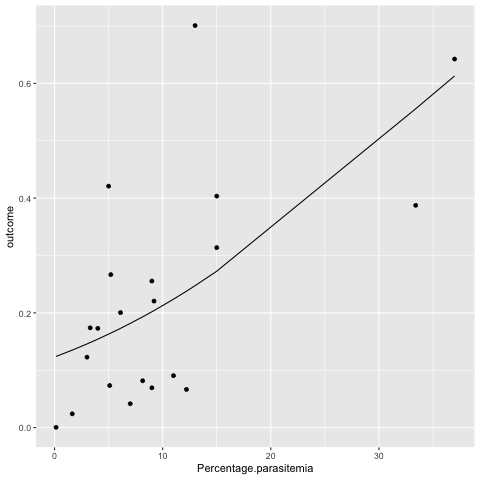

## The generalized linear model (GLM)
<big>

**In cases where for certain response variables the just tested assumptions do not hold, generalized linear models (GLM) are very good at dealing with them.** They are an extension of the linear regression model.
In general, GLMs are recommended when
* the variance is not constant (heteroscedasticity) and/or
* the errors are not normally distributed.

In our case where the response variable is a percentage or a proportion derived from count data, GLMs prove especially useful. We use a logistic regression, which is similar to a linear regression except for the logit link function (and the response variable does not have to be normally distributed). The logit link function is simply a function that is applied to the mean of the outcome variable instead of the outcome itself, ie we transform the percentage scores into logits and use them as outcome for the linear regression. Indeed the plot of the GLM with a logit link function in figure 1 does not differ much from the linear models seen in chapter _Checking assumptions of linear regression model_.

This approach has a couple of advantages
* Unlike a simple linear model it does not predict scores outside of the boundary which would make interpretation difficult, since logits boundaries are -infinite and +infinite.
* The results are relatively easy to interpret.
* Once the model is fit, we can easily back-transform the estimated regression coefficients off of a log scale so that we can interpret the effects of each independent variable.

    

**Figure 1:** GLM with a logit link function on our sample data set

---
**Note:**

However, neither zeros nor ones can be included in a logit, since the logit transformation is not defined for those values. 
A strategy for handling proportions data in which zeros and ones may appear as well as intermediate values was proposed by Papke and Wooldridge (1996) [4]. We did not face this problem in the given data set but is might be relevant for future data set to improve our model.

---

<!--- Beta-Regression might be the model you are looking for. The following vignette shows how to apply beta regression in R using Cribari-Neto's and Zeileis's "betareg"-Package: ftp://cran.r-project.org/pub/R/web/packages/betareg/vignettes/betareg.pdf 
--->

Additionally, we used statistical methods from [3] to empirically identify an appropriate transformation, including a family of transformations that are indexed by a parameter proposed by Box and Cox (1964) [5].
</big>
