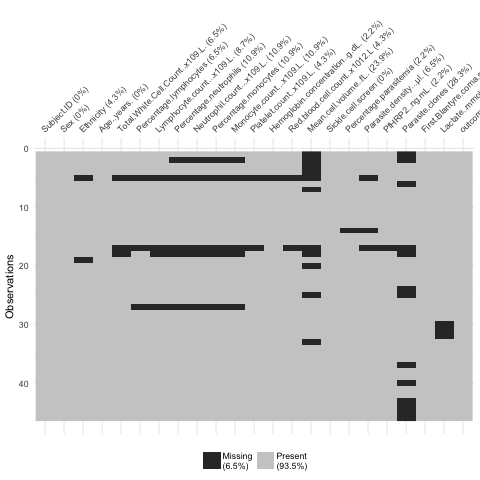
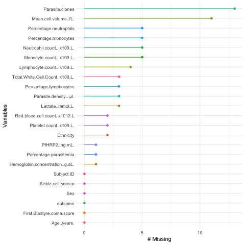

# Data
<big>
| Data set                  | Description |
| --------------------------| ------------|
| __#1: main data set__     | __46 samples from malaria patients and 23 variables__ |

The data that was used was a RNA-seq data set (library prep, sequencing methods); a detailed description can be found in [1].
It consisted of 46 samples from malaria patients and 24 variables (see figure 1 for a preview [INSERT LINK HERE]). As various values were missing (see figure 2 and figure 3 below), we only took the samples that were complete. However, only 21 samples were complete on all 24 variables. Therefore, we only discarded the non-complete samples after variable selection (see chapter _Methods_ [INSERT LINK HERE]), ie the ones that were not complete on the variables that we identified as most explaining. This complete data set containing 40 samples and for 6 important variables (Parasitemia percentage, parasitemia density, total white blood cell count, as well as lymphocytes, monocytes and neutrophils counts) and the repsonse variable (percentage of reads that map to the pathogen, referred to as the _outcome_ here). It is important to note, that for computing the latter we assumed a unique map of every read to either the pathogen or the host. This was an important assumption and a constraint of our model(s).
For a detailed protocol on how the data was obtained we refer to [1] [INSERT LINK HERE].

[](../img/missingData.png)  | [](../img/missingData2.png) | 
|:---:|:---:|
| Figure 1: Missing values displayed over the data set matrix | Figure 2: Rank of variables with missing values |
</big>
<!---
### 2. Two other data sets not presented here

| Data set                  | Description |
| --------------------------| ------------|
| #2: mice data             | parasitemia perecentage and counts of pathogen and host read maps |
| #3: developmental stages  | measurements at different time points in the cycle |

One consisted of RNA Seq data from mice containing 33 samples. However, parasitemia percentage was the only variable available for prediction. Additionally, it contained many zero values that might have resulted from measurement errors or due to actual non-infected mice. 
Here, the logit transformation proved to be useful as the residuals of a linear model showed highly non-normal behaviour. A logit regression model has been developed and is available, please [contact us](mailto:felicia.burtscher17@imperial.ac.uk).

The other data set analysed captured the SPVs (surrogate proportion variables) for each parasite developmental stage. The measurements were from different time points in the life cycle (0hrs, 24hrs and 48 hrs) progressing from most immature to most mature stages. It also contained the level of [gametocytes (Gam5)](https://en.wikipedia.org/wiki/Gametocyte "eukaryotic germ cells") which are the sexual stage of the parasite.
Significant relationships between the developmental stage and some variables, ie increase in total white cell count, [PfHRP2](https://www.malariasite.com/tag/pfhrp2/ "histidine-rich protein-3, an important indicator in malaria studies") concentration, and [lactate](https://malariajournal.biomedcentral.com/articles/10.1186/1475-2875-5-101 "Click here to read more on the relaitonship between lactate and malaria!") as well as a decrease in total red blood cell count, [hemoglobin](https://www.emedicinehealth.com/hemoglobin_levels/article_em.htm "a protein found in red blood cells") concentraion and parasite clone could be found. 

However, the developmental stages were not directly correlated to our response variable, and did not explain the outliers found in our dataset. Therefore, we did not incorporate them in the model presented.
Nontheless, they might be relevant for more complex models and once more data has become available.

--->
<!---
```{r}

library(visdat)
library(naniar)
par(mfrow = c(1, 2))
vis_miss(dat[,-c(23,24,25,27)])
gg_miss_var(dat[,-c(23,24,25,27)])

```
--->

<!---
![alt text][missing]
![alt text][missing2]

[missing]: ../img/missingData.png "Missing values in the data set"

[missing2]: ../img/missingData2.png "Missing values in the data set"
--->
