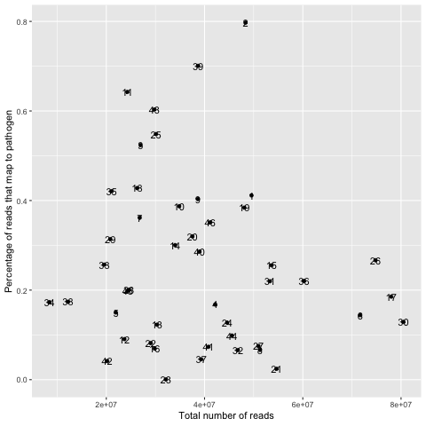

# Data
<big>

### 1. Main data set: 46 samples from malaria patients and 23 variables

The data that was used was a RNA-seq data set (library prep, sequencing methods); a detailed description can be found in [1].
It consisted of 46 samples from malaria patients and 23 variables. Various values were missing (see figure 2 and figure 3 below); the data could be either structurally missing, or it was not determined which is the most probable case in the given data set. Moreover, it did not contain zero-values as in the other data sets (see below). Therefore, we only took the samples that were complete. However, only 21 samples were complete on all 23 variables. Therefore, we only discarded the non-complete samples after variable selection (see chapter _Methods_), ie the ones that were not complete on the variables that we identified as most explaining. This complete data set containing 40 samples and for 6 important variables (Parasitemia percentage, parasitemia density, total white blood cell count, as well as lymphocytes, monocytes and neutrophils counts) and the response variable (percentage of reads that map to the pathogen, referred to as the _outcome_ here). It is important to note, that for computing the latter we assumed a unique map of every read to either the pathogen or the host. This was an important assumption and a constraint of our model(s).
For a detailed protocol on how the data was obtained we refer to [1].

<p>
    
</p>
**Figure 1**: Missing values displayed over the data set matrix 
<br>

</br>
<p>
    
</p>
**Figure 2**: Rank of variables with missing values

<br>
</br>

Initial exploratory data analysis supports our statement made in the abstract (see chapter _Abstract_).

<br>
</br>
<p>
    
</p>
**Figure 1:** Scatterplot of the data set: Number of total reads in the sample against the percentage of pathogen reads. The numbers indicate the sample IDs. We can see that the pathogen percentage varies a lot (between almost 0% in sample 26 — most probably a still healthy person to 80%). We cannot identify any pattern that would indicate that the number of total reads in a sample is any correlated to the percentage of pathogen reads. It seems intuitive to assume that the number of reads we find in a sample is independent of the percentage of reads that map to the pathogen.

<br>
</br>
Now we forget about the x-axis (total number of reads in the sample) by projecting it down onto the y-axis to look at the distribution of the samples that map to the pathogen. This can be seen in the density plot in figure 2.
<p>
    
</p>
**Figure 2:** Density plot of reads that map to the pathogen: The x-axis shows the percentage of pathogen reads, the y-axis reflects the amount of samples in our data set. The pathogen percentage varies a lot (eg we do not see a vertical line or a very high peak) but it is still not uniformly distributed (which would result in a horizontal line over the whole x-axis). In the given data set most samples mapped with around 18% of the total reads to the pathogen. Note: The area under the curve itegrates to 1. The area below the curve in the negative x-region is due to the chosen bandwith.


<!---

**Figure 1**: Missing values displayed over the data set matrix 

 
**Figure 2**: Rank of variables with missing values
--->
<br>
</br>

### 2. Two other data sets not presented here

* mice data: parasitemia perecentage and counts of pathogen and host read maps
* developmental stages: measurements at different time points in the cycle

<!---
| Data set                  | Description |
| --------------------------| ------------|
| #2: mice data             | parasitemia perecentage and counts of pathogen and host read maps |
| #3: developmental stages  | measurements at different time points in the cycle |
--->

One consisted of RNA Seq data from mice containing 33 samples. However, parasitemia percentage was the only variable available for prediction. Additionally, it contained many zero values that might have resulted from measurement errors or due to actual non-infected mice. 
Here, the logit transformation proved to be useful as the residuals of a linear model showed highly non-normal behaviour. A logit regression model has been developed and is available, please [contact us](mailto:felicia.burtscher17@imperial.ac.uk).

The other data set analysed captured the SPVs (surrogate proportion variables) for each parasite developmental stage. The measurements were from different time points in the life cycle (0hrs, 24hrs and 48 hrs) progressing from most immature to most mature stages. It also contained the level of [gametocytes (Gam5)](https://en.wikipedia.org/wiki/Gametocyte "eukaryotic germ cells") which are the sexual stage of the parasite.
Significant relationships between the developmental stage and some variables, ie increase in total white cell count, [PfHRP2](https://www.malariasite.com/tag/pfhrp2/ "histidine-rich protein-3, an important indicator in malaria studies") concentration, and [lactate](https://malariajournal.biomedcentral.com/articles/10.1186/1475-2875-5-101 "Click here to read more on the relaitonship between lactate and malaria!") as well as a decrease in total red blood cell count, [hemoglobin](https://www.emedicinehealth.com/hemoglobin_levels/article_em.htm "a protein found in red blood cells") concentraion and parasite clone could be found. 

However, the developmental stages were not directly correlated to our response variable, and did not explain the outliers found in our dataset. Therefore, we did not incorporate them in the model presented.
Nontheless, they might be relevant for more complex models and once more data has become available.

</big>


<!---
```{r}

library(visdat)
library(naniar)
par(mfrow = c(1, 2))
vis_miss(dat[,-c(23,24,25,27)])
gg_miss_var(dat[,-c(23,24,25,27)])

```

![alt text][missing]
![alt text][missing2]

[missing]: ../img/missingData.png "Missing values in the data set"

[missing2]: ../img/missingData2.png "Missing values in the data set"
--->
